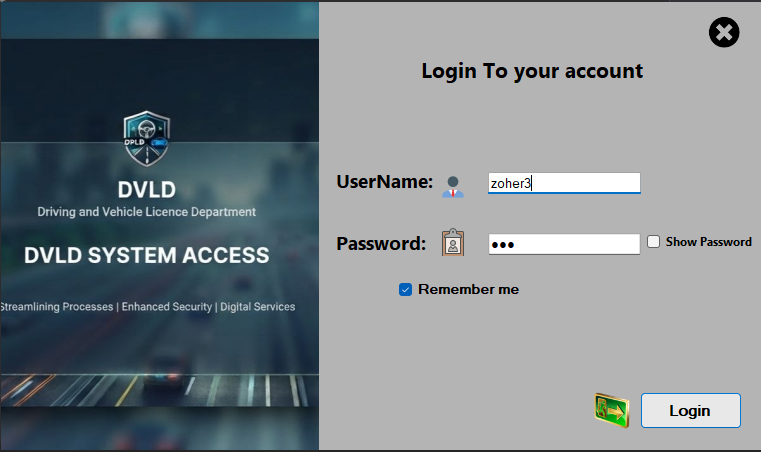
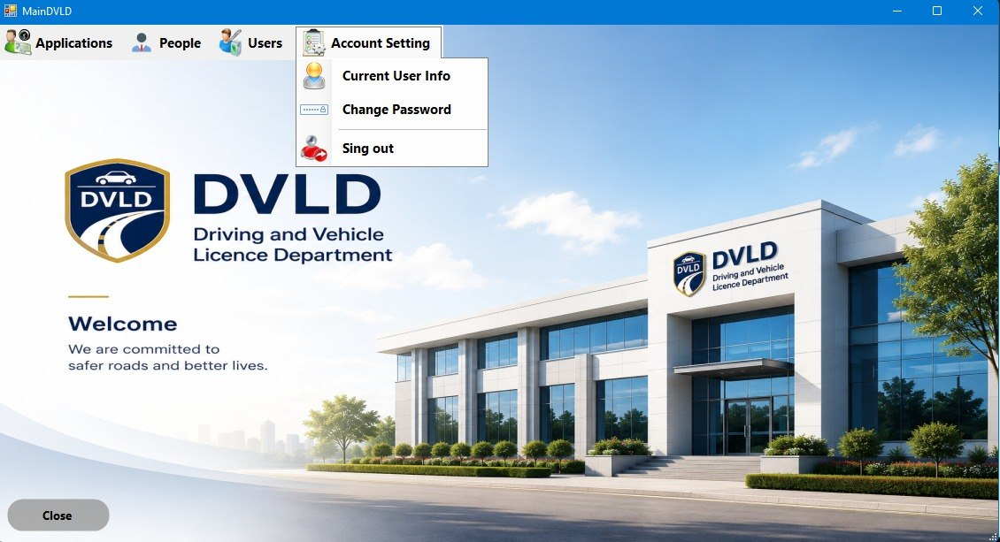
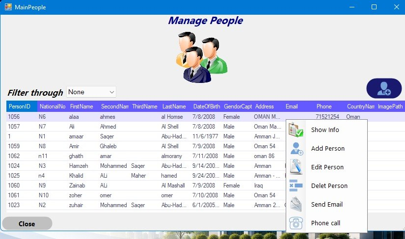
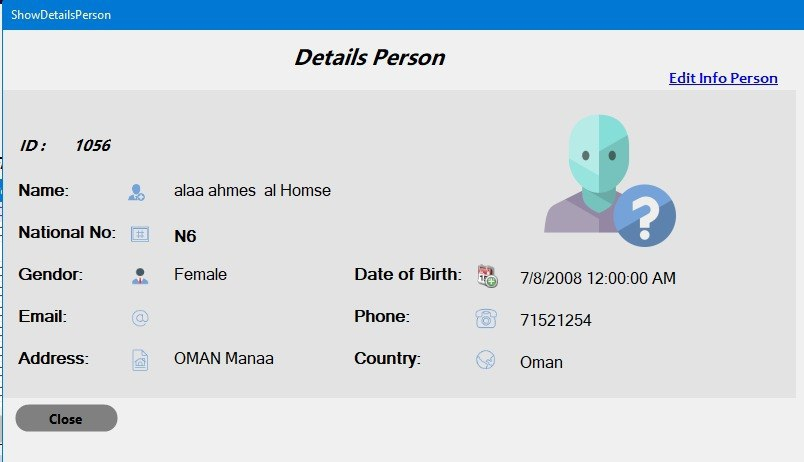
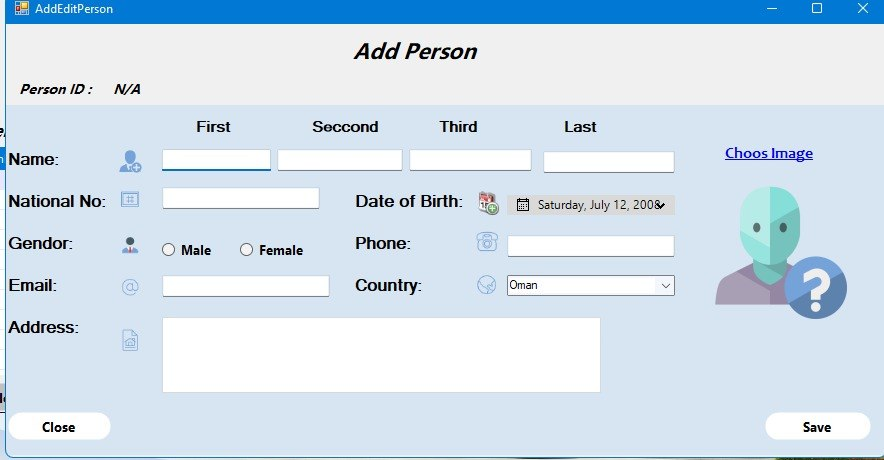
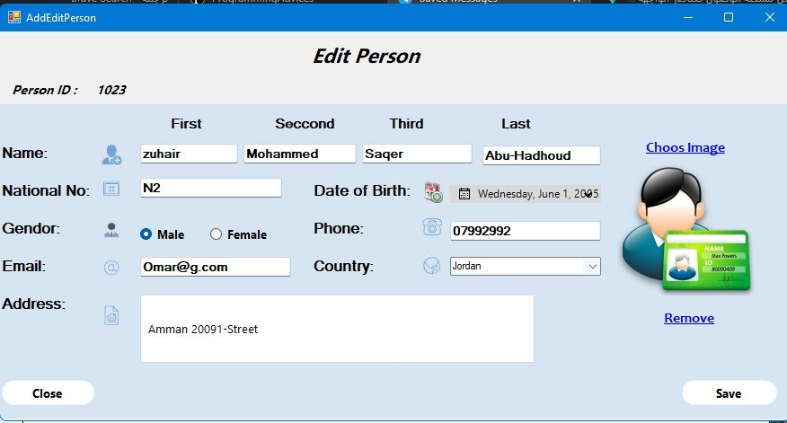
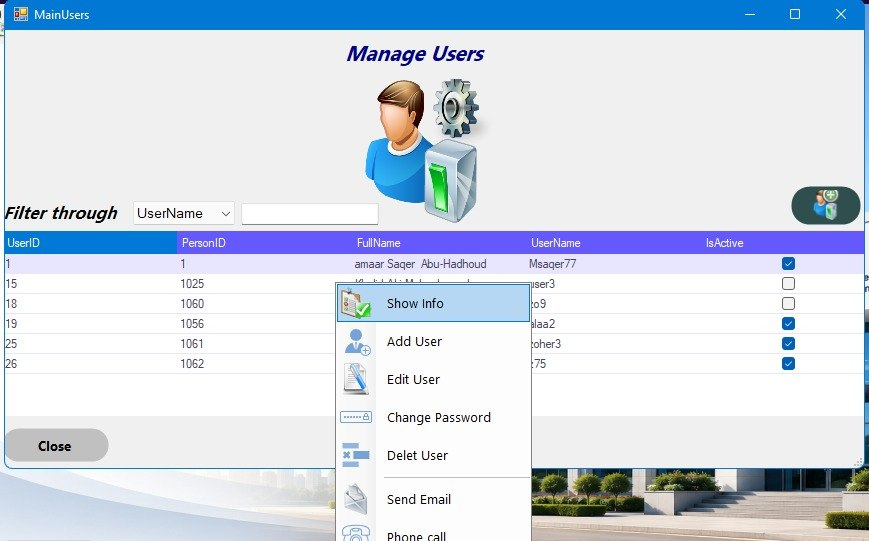
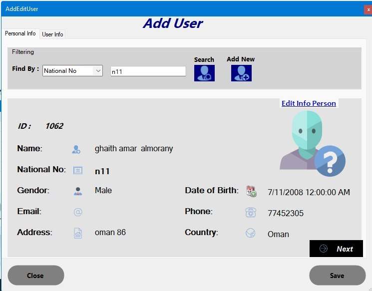
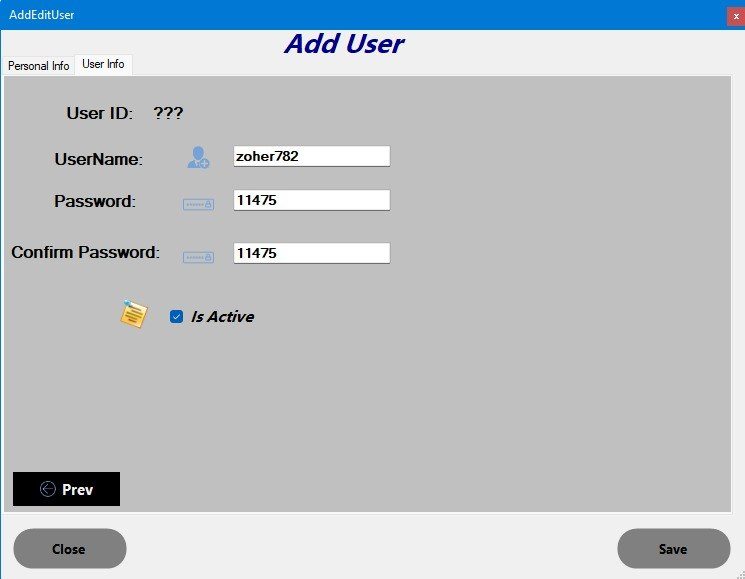
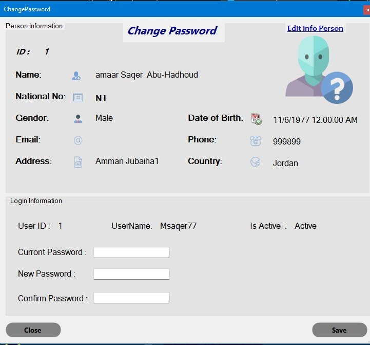

# 🚗 Driving & Vehicle License Department (DVLD) System

An enterprise-grade desktop application built with C# and .NET Framework to automate and streamline the management of driving license services. This project implements a robust **3-Tier Architecture** to ensure high data integrity, security, and scalability.

## 📋 Project Overview

The **DVLD System** provides a digital transformation for licensing authorities. It manages the full lifecycle of a license, from personal record registration to the issuance of professional licenses, ensuring every step is documented and validated against strict business rules.

## 🛠 Tech Stack
*   **Language:** C# (.NET Framework)
*   **UI:** Windows Forms
*   **Database:** SQL Server (ADO.NET)
*   **Design Pattern:** 3-Tier Architecture (Presentation, BLL, DAL)

---

## 🚀 System Modules & Showcase

### 1. Authentication & Core Interface
Secure access control and the main dashboard for navigation.

*   **Features:** Secure login, session management, and role-based access.

### 2. Person Management (The Foundation)
A centralized module to manage all individuals in the system.

*   **Features:** National ID integration, duplication prevention, and advanced filtering capabilities.

### 3. User Management
System user administration with strict security protocols.

*   **Features:** Role mapping to Persons, account activation, and high-security credential management.

---

## 🏗 Architectural Strength
The system is built on **3-Tier Architecture**:

*   **Presentation Layer:** Intuitive UI with real-time input validation.
*   **Business Layer (BLL):** Enforces complex logic like age requirements and license eligibility.
*   **Data Access Layer (DAL):** Secure communication with SQL Server via Stored Procedures.

## 🛣 Roadmap & Future Scope
*   [ ] **License Classes Management:** Defining categories, fees, and validity.
*   [ ] **Testing System:** Scheduling vision, written, and practical.
*   [ ] **License Services:** New, Renewal, Replacement, and International licenses.
*   [ ] **Restriction Management:** License locking and unlocking.

## 🛡 Auditing
Transparency is at our core: every transaction, update, or deletion is timestamped and attributed to the specific user, ensuring full accountability across all system operations.
